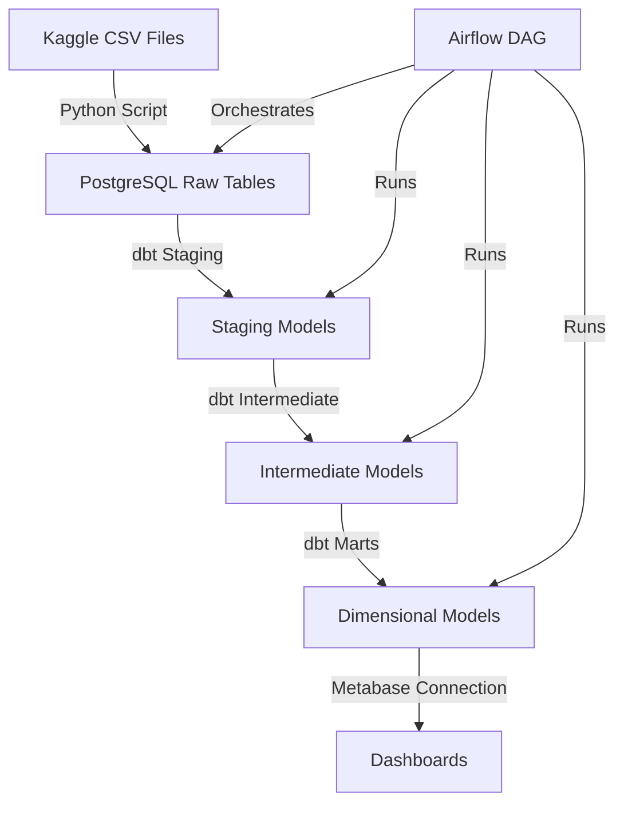

# E-Commerce Analytics Pipeline

A production-grade analytics pipeline demonstrating end-to-end analytics engineering capabilities using real e-commerce data from the Brazilian E-Commerce dataset (Olist).

## What does this do?

This project processes ~100k e-commerce orders to deliver insights on:
- **Revenue Analytics**: Sales performance, trends, and forecasting
- **Customer Analytics**: Customer lifetime value, cohort analysis, retention
- **Product Analytics**: Best/worst performers, category analysis
- **Operational Analytics**: Delivery performance, seller metrics, review sentiment

## Why does it exist?

This project demonstrates:
- **Data Engineering**: Automated ingestion, orchestration, containerization
- **Analytics Engineering**: dbt modeling, testing, documentation
- **SQL Mastery**: Complex joins, window functions, aggregations
- **Data Modeling**: Dimensional modeling (Kimball methodology)
- **Business Acumen**: Translating data into actionable insights
- **DevOps**: Docker, CI/CD, version control

## How do I run it?

### Prerequisites

- Docker and Docker Compose
- Python 3.10+
- Git
- Kaggle account (to download dataset)

### Quick Start (15 minutes)

1. **Clone the repository**
```bash
git clone <repository-url>
cd analytics_project_1
```

2. **Download the dataset**
   - Go to [Kaggle: Brazilian E-Commerce Dataset](https://www.kaggle.com/datasets/olistbr/brazilian-ecommerce)
   - Download all CSV files
   - Place them in `data/raw/` directory

3. **Set up environment**
```bash
cp .env.example .env
# Edit .env with your preferred database credentials
```

4. **Start Docker services**
```bash
docker-compose up -d
```

This starts:
- PostgreSQL (port 5432)
- Metabase (port 3000)
- Airflow (port 8080)

5. **Load data into PostgreSQL**
```bash
pip install -r ingestion/requirements.txt
python ingestion/load_to_postgres.py
```

6. **Run dbt transformations**
```bash
cd dbt_project
dbt deps  # Install dbt packages
dbt run   # Run all models
dbt test  # Run all tests
```

7. **Access dashboards**
   - Metabase: http://localhost:3000
   - Airflow: http://localhost:8080 (airflow/airflow)

### Architecture



### Project Structure

```
analytics_project_1/
├── data/
│   └── raw/                    # Kaggle CSV files (gitignored)
├── ingestion/
│   ├── load_to_postgres.py     # Script to load CSVs into PostgreSQL
│   ├── requirements.txt
│   └── README.md
├── dbt_project/
│   ├── models/
│   │   ├── staging/            # 1:1 with source tables, light cleaning
│   │   ├── intermediate/       # Business logic, joins, aggregations
│   │   └── marts/              # Final analytics tables (facts & dims)
│   ├── dbt_project.yml
│   └── README.md
├── airflow/
│   ├── dags/
│   │   └── ecommerce_pipeline.py
│   └── README.md
├── dashboards/
│   ├── screenshots/            # Dashboard screenshots for portfolio
│   └── metabase_exports/       # Dashboard configs
├── docs/
│   ├── ARCHITECTURE.md
│   └── DATA_MODEL.md
├── docker-compose.yml          # Orchestrates Postgres + Metabase + Airflow
├── .gitignore
└── README.md
```

### Data Model

The project follows Kimball dimensional modeling:

**Fact Tables:**
- `fct_orders` - Order-level metrics (revenue, item count, delivery time)
- `fct_order_items` - Item-level metrics (price, freight, quantity)

**Dimension Tables:**
- `dim_customers` - Customer attributes and CLV
- `dim_products` - Product catalog with category hierarchy
- `dim_sellers` - Seller information and performance
- `dim_dates` - Date dimension for time analysis
- `dim_geolocation` - Geographic dimension

### Key Metrics

- **Revenue Metrics**: Total revenue, revenue by category, monthly trends
- **Customer Metrics**: CLV, repeat purchase rate, customer cohorts
- **Operational Metrics**: Average delivery time, delivery performance
- **Product Metrics**: Top products by revenue, review scores

### Dashboards

Four core dashboards in Metabase:

1. **Executive Summary** - Revenue KPIs, trends, top categories
2. **Customer Analytics** - Cohorts, CLV, segmentation
3. **Product Performance** - Best/worst sellers, category analysis
4. **Operational Insights** - Delivery performance, seller metrics

## What are the dependencies?

### Infrastructure
- Docker & Docker Compose
- PostgreSQL 15
- Apache Airflow 2.7.0
- Metabase

### Python
- pandas>=2.0.0,<3.0.0
- psycopg2-binary
- sqlalchemy
- python-dotenv

### dbt
- dbt-core
- dbt-postgres
- dbt-utils
- dbt-expectations

See individual `requirements.txt` files in each directory for specific dependencies.

## Testing

The project includes comprehensive dbt tests:
- Primary key tests (unique, not_null)
- Foreign key tests (relationships)
- Business rule tests (accepted_values)
- Data quality tests (custom tests)

Target: **95%+ test coverage** on marts layer

Run tests: `dbt test`

## CI/CD

GitHub Actions workflow (`.github/workflows/dbt_tests.yml`) runs:
- dbt tests on pull requests
- dbt documentation generation
- Deploys docs to GitHub Pages

## Documentation

- **Main README**: This file
- **Architecture**: `docs/ARCHITECTURE.md`
- **Data Model**: `docs/DATA_MODEL.md`
- **dbt Docs**: Run `dbt docs generate && dbt docs serve`

## Troubleshooting

**Docker container won't start:**
- Check if port is already in use: `lsof -i :5432`
- Review logs: `docker logs <container_name>`

**dbt models fail:**
- Run with verbose logging: `dbt run --debug`
- Check `dbt_project/logs/dbt.log`

**CSV won't load to PostgreSQL:**
- Verify CSV encoding (should be UTF-8)
- Check for malformed rows
- Look for column name mismatches

## License

This project is for portfolio/educational purposes. Dataset is from Kaggle: [Brazilian E-Commerce Public Dataset by Olist](https://www.kaggle.com/datasets/olistbr/brazilian-ecommerce)

## Contributing

This is a portfolio project. For questions or improvements, please open an issue.
