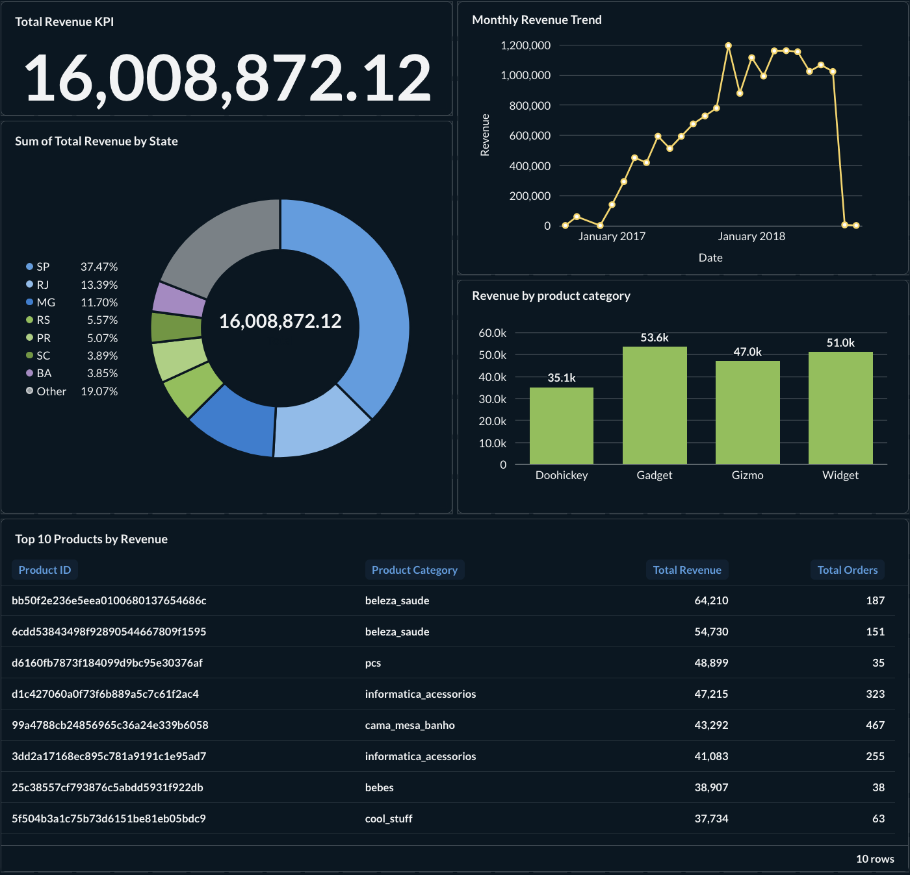
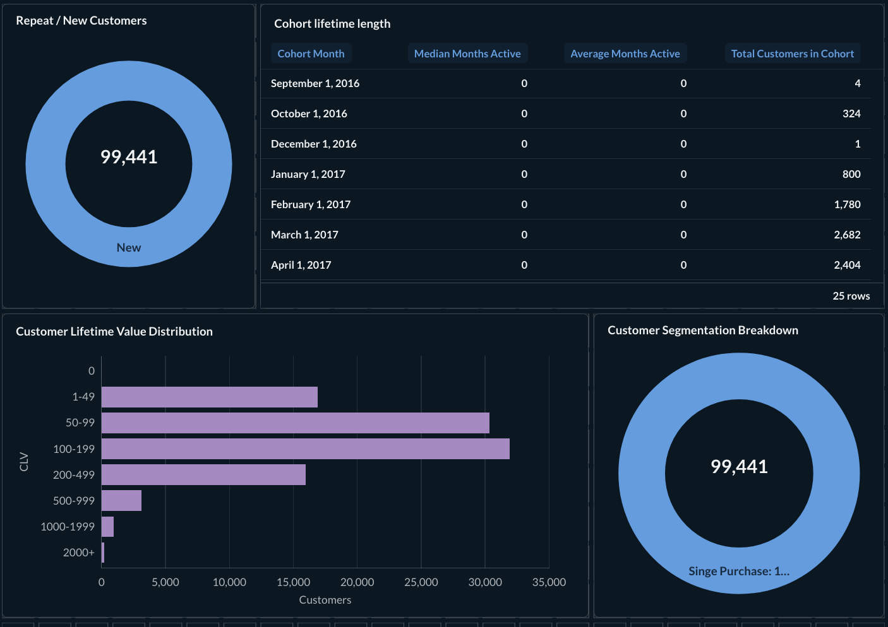
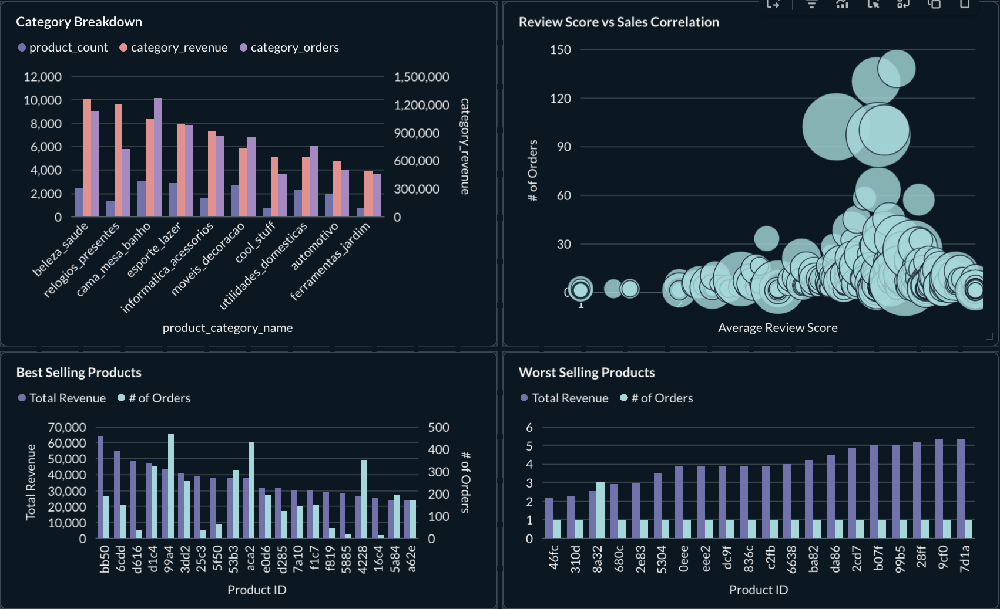
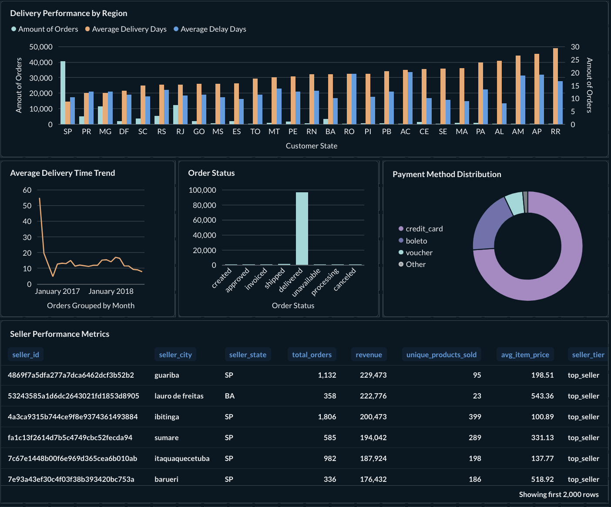

# Metabase Dashboards

This directory contains resources for creating and managing Metabase dashboards for the e-commerce analytics pipeline.

## Contents

- **`screenshots/`** - Dashboard screenshots for portfolio showcase

## Dashboard Screenshots

### Executive Summary Dashboard

### Customer Analytics Dashboard

### Product Performance Dashboard

### Operational Insights Dashboard

## Planned Dashboards

1. **Executive Summary Dashboard**
   - Total revenue KPI
   - Monthly revenue trend
   - Revenue by category
   - Top 10 products by revenue
   - Geographic distribution

2. **Customer Analytics Dashboard**
   - Cohort lifetime length
   - CLV distribution
   - New vs returning customers
   - Customer segmentation breakdown

3. **Product Performance Dashboard**
   - Best selling products
   - Worst selling products
   - Category breakdown
   - Review score vs sales correlation

4. **Operational Insights Dashboard**
   - Delivery performance by region
   - Average delivery time trend
   - Seller performance metrics
   - Payment method distribution
   - Order status funnel

## Getting Started

1. Access Metabase at http://localhost:3000
2. Reference `DATA_EXTRACTION_GUIDE.md` for each dashboard component
3. Use the provided SQL queries or build questions using Metabase's query builder
4. Create dashboards and add questions to them
5. Take screenshots and save to `screenshots/` directory (create if needed)

## Database Connection

- **Host**: `postgres` (Docker service name) or `localhost:5432` (from host)
- **Database**: `ecommerce`
- **Username**: `analytics`
- **Password**: `analytics`
- **Schema**: Use `public_marts` for all dashboard queries

## Notes

- All marts tables are materialized as tables for better performance
- Always use schema-qualified table names: `public_marts.table_name`
- Payment data is in `public_staging.stg_order_payments`
- Date dimensions are available in `public_marts.dim_dates` for time-based analysis
