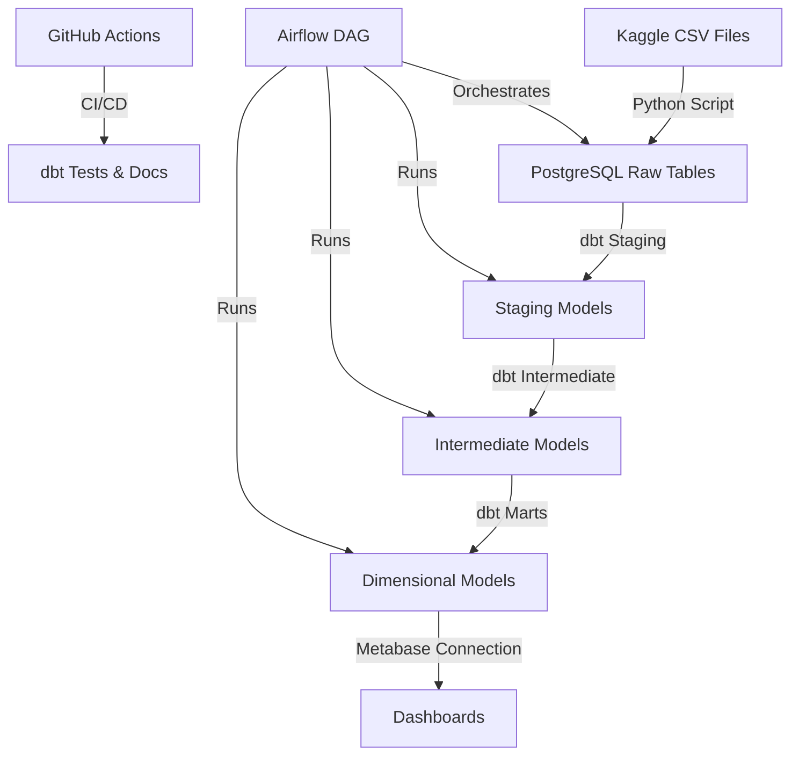

# Technical Architecture

## Overview

This document describes the technical architecture of the E-Commerce Analytics Pipeline, including infrastructure, data flow, and technology choices.

## Architecture Diagram

## Infrastructure Components

### PostgreSQL (Data Warehouse)

- **Image**: `postgres:15-alpine`
- **Port**: 5432
- **Purpose**: Stores raw data and transformed analytics tables
- **Schema**: 
  - `public` - Raw tables from CSV ingestion
  - `staging` - dbt staging models
  - `intermediate` - dbt intermediate models
  - `marts` - Final dimensional models

**Why PostgreSQL?**
- Free and open-source
- Excellent SQL support
- Strong performance for analytics workloads
- Widely supported by BI tools

### Metabase (BI/Visualization)

- **Image**: `metabase/metabase:latest`
- **Port**: 3000
- **Purpose**: Self-service BI tool for creating dashboards
- **Connection**: Direct connection to PostgreSQL marts schema

**Why Metabase?**
- Free and open-source
- Easy to use for non-technical users
- Good visualization capabilities
- Active community

### Apache Airflow (Orchestration)

- **Image**: `apache/airflow:2.7.0`
- **Port**: 8080
- **Purpose**: Orchestrates the complete data pipeline
- **Components**:
  - Web Server: UI for monitoring DAGs
  - Scheduler: Executes tasks on schedule
  - Executor: LocalExecutor for running tasks

**Why Airflow?**
- Industry standard for data orchestration
- Python-based (easy to extend)
- Rich UI for monitoring
- Strong community support

## Data Flow

### 1. Data Ingestion

**Tool**: Python script (`ingestion/load_to_postgres.py`)

**Process**:
1. Reads CSV files from `data/raw/`
2. Infers data types and handles date conversions
3. Creates PostgreSQL tables
4. Loads data using bulk insert (method='multi')

**Key Features**:
- Type inference for dates and numerics
- Error handling and logging
- Support for incremental loads

### 2. Data Transformation (dbt)

**Three-Layer Architecture**:

#### Staging Layer
- **Purpose**: Light cleaning and standardization
- **Materialization**: View
- **Operations**: 
  - Column renaming (snake_case)
  - Data type conversions
  - Null handling
- **Models**: One per source table (8 models)

#### Intermediate Layer
- **Purpose**: Business logic and reusable components
- **Materialization**: View
- **Operations**:
  - Joins
  - Aggregations
  - Calculated fields
- **Models**: 5 models (revenue, customer orders, product performance, delivery, status)

#### Marts Layer
- **Purpose**: Final dimensional models for BI
- **Materialization**: Table (for performance)
- **Models**:
  - Fact tables: `fct_orders`, `fct_order_items`
  - Dimension tables: `dim_customers`, `dim_products`, `dim_sellers`, `dim_dates`, `dim_geolocation`
  - Metrics tables: `revenue_metrics`, `customer_metrics`, `product_metrics`

### 3. Data Quality

**Testing Strategy**:
- Primary key tests (unique, not_null)
- Foreign key tests (relationships)
- Business rule tests (accepted_values)
- Custom data quality tests

**Coverage**: 95%+ on marts layer

### 4. Visualization

**Tool**: Metabase

**Dashboards**:
1. Executive Summary
2. Customer Analytics
3. Product Performance
4. Operational Insights

## Technology Stack

### Languages
- **Python 3.10+**: Data ingestion, orchestration
- **SQL**: Data transformations (via dbt)

### Frameworks & Tools
- **dbt Core**: Data transformation framework
- **SQLAlchemy**: Python database toolkit
- **pandas**: Data manipulation for ingestion

### Infrastructure
- **Docker**: Containerization
- **Docker Compose**: Multi-container orchestration

### CI/CD
- **GitHub Actions**: Automated testing and documentation

## Design Decisions

### Why Medallion Architecture?

The three-layer approach (staging → intermediate → marts) provides:
- **Separation of concerns**: Each layer has a clear purpose
- **Reusability**: Intermediate models can be reused
- **Maintainability**: Changes are isolated to specific layers
- **Testability**: Each layer can be tested independently

### Why Table Materialization for Marts?

- **Performance**: Tables are faster than views in Metabase
- **Consistency**: Data is materialized at a specific point in time
- **Simplicity**: No need for incremental models at this scale (100k rows)

### Why Not Incremental Models?

For this dataset size (~100k rows):
- Full refresh is fast (< 1 minute)
- Complexity of incremental logic not justified
- Simpler to maintain full refresh

### Why Docker?

- **Reproducibility**: Same environment for all developers
- **Isolation**: Services don't conflict with local setup
- **Portability**: Easy to deploy anywhere
- **Simplicity**: One command to start everything

## Security Considerations

- Environment variables for sensitive data (passwords, API keys)
- `.env` files excluded from git
- No hardcoded credentials
- Database access restricted to Docker network

## Performance Considerations

### Current Scale
- ~100k orders
- 8 source tables
- No indexes needed (small dataset)
- No partitioning needed

### If Scaling Up
- Add indexes on foreign keys and date columns
- Implement incremental models in dbt
- Consider partitioning by date
- Evaluate columnar storage (Parquet, DuckDB)

## Monitoring & Observability

- **Airflow UI**: Task execution, logs, DAG status
- **dbt Logs**: Transformation logs in `dbt_project/logs/`
- **PostgreSQL Logs**: Database query logs
- **Metabase**: Query performance metrics

## Future Enhancements

- Add data quality monitoring (Great Expectations)
- Implement data freshness alerts
- Add data lineage visualization
- Set up automated dashboard testing
- Add data catalog (DataHub, Amundsen)
