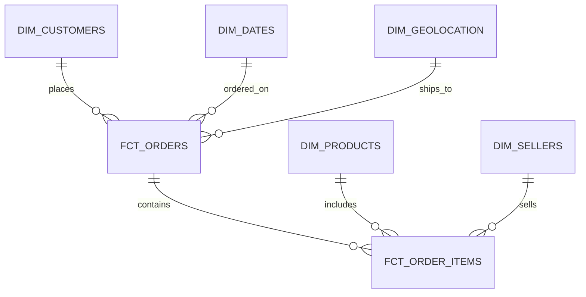

# Data Model Documentation

## Overview

This document describes the dimensional data model used in the E-Commerce Analytics Pipeline. The model follows Kimball methodology with fact and dimension tables.

## Entity Relationship Diagram



## Fact Tables

### fct_orders

**Grain**: One row per order

**Primary Key**: `order_id`

**Foreign Keys**:
- `customer_id` → `dim_customers.customer_id`
- `order_date` → `dim_dates.date_key`

**Metrics**:
- `total_revenue`: Sum of all payments for the order
- `item_count`: Number of items in the order
- `items_total`: Sum of item prices
- `freight_total`: Sum of freight costs
- `total_delivery_time_days`: Days from purchase to delivery
- `delivery_delay_days`: Days delayed from estimated delivery

**Attributes**:
- `order_status`: Current order status
- `customer_state`: Customer's state
- `customer_city`: Customer's city
- `purchased_at`: Order purchase timestamp
- `estimated_delivery_at`: Estimated delivery date

**Use Cases**:
- Order-level revenue analysis
- Delivery performance tracking
- Order status monitoring

### fct_order_items

**Grain**: One row per order item

**Primary Key**: `order_id` + `order_item_id` (composite)

**Foreign Keys**:
- `order_id` → `fct_orders.order_id`
- `product_id` → `dim_products.product_id`
- `seller_id` → `dim_sellers.seller_id`
- `order_date_key` → `dim_dates.date_key`

**Metrics**:
- `price`: Item price
- `freight_value`: Freight cost for item
- `total_item_value`: Price + freight

**Attributes**:
- `shipping_limit_at`: Shipping deadline

**Use Cases**:
- Product-level revenue analysis
- Seller performance analysis
- Item-level profitability

## Dimension Tables

### dim_customers

**Grain**: One row per unique customer

**Primary Key**: `customer_unique_id`

**Attributes**:
- `customer_id`: Order-level customer ID
- `customer_city`: Customer city
- `customer_state`: Customer state
- `customer_zip_code_prefix`: Zip code prefix

**Calculated Fields**:
- `total_orders`: Total number of orders placed
- `first_order_date`: Date of first order
- `last_order_date`: Date of most recent order
- `delivered_orders`: Number of delivered orders
- `lifetime_value`: Total revenue from customer
- `customer_segment`: single_purchase / repeat_customer / loyal_customer

**Use Cases**:
- Customer segmentation
- CLV analysis
- Customer cohort analysis

### dim_products

**Grain**: One row per product

**Primary Key**: `product_id`

**Attributes**:
- `product_category_name`: Product category
- `product_name_length`: Length of product name
- `product_description_length`: Length of description
- `product_photos_quantity`: Number of photos
- `product_weight_g`: Weight in grams
- `product_length_cm`: Length in cm
- `product_height_cm`: Height in cm
- `product_width_cm`: Width in cm

**Calculated Fields**:
- `order_count`: Number of orders containing product
- `total_revenue`: Total revenue from product
- `avg_review_score`: Average review score
- `product_value_tier`: high_value / medium_value / low_value

**Use Cases**:
- Product performance analysis
- Category analysis
- Product catalog management

### dim_sellers

**Grain**: One row per seller

**Primary Key**: `seller_id`

**Attributes**:
- `seller_city`: Seller city
- `seller_state`: Seller state
- `seller_zip_code_prefix`: Zip code prefix

**Calculated Fields**:
- `total_orders`: Total number of orders
- `unique_products_sold`: Number of unique products sold
- `total_revenue`: Total revenue generated
- `total_freight`: Total freight collected
- `avg_item_price`: Average item price
- `seller_tier`: top_seller / active_seller / small_seller

**Use Cases**:
- Seller performance analysis
- Seller segmentation
- Geographic seller analysis

### dim_dates

**Grain**: One row per date

**Primary Key**: `date_key` (YYYY-MM-DD format)

**Attributes**:
- `date_day`: Date value
- `year`: Year (2016-2018)
- `quarter`: Quarter (1-4)
- `month`: Month (1-12)
- `week`: Week number
- `day`: Day of month
- `day_of_week`: Day of week (0-6, Sunday=0)
- `day_of_year`: Day of year (1-365)
- `month_name`: Full month name
- `day_name`: Full day name
- `quarter_name`: Quarter name (Q1-Q4)
- `fiscal_year`: Fiscal year
- `is_weekend`: Boolean
- `is_month_end`: Boolean

**Use Cases**:
- Time-based analysis
- Trend analysis
- Seasonal patterns

### dim_geolocation

**Grain**: One row per zip code prefix

**Primary Key**: `zip_code_prefix`

**Attributes**:
- `city`: City name
- `state`: State abbreviation
- `latitude`: Latitude coordinate
- `longitude`: Longitude coordinate
- `region`: Brazilian region (Southeast, South, Northeast, Central-West, North)

**Use Cases**:
- Geographic analysis
- Regional performance
- Delivery optimization

## Metrics Tables

### revenue_metrics

**Purpose**: Pre-aggregated revenue by dimension

**Dimensions**:
- `dimension_type`: date / state / category
- `dimension_value`: Value of the dimension

**Metrics**:
- `revenue`: Total revenue
- `order_count`: Number of orders

**Use Cases**:
- Quick revenue queries
- Dashboard performance
- Pre-calculated aggregations

### customer_metrics

**Purpose**: Customer cohort and retention metrics

**Attributes**:
- `customer_unique_id`: Foreign key to dim_customers
- `cohort_month`: First order month
- `months_since_first_order`: Months since first order
- `is_repeat_customer`: Boolean

**Use Cases**:
- Cohort analysis
- Retention analysis
- Customer lifecycle

### product_metrics

**Purpose**: Product performance rankings

**Attributes**:
- `product_id`: Foreign key to dim_products
- `revenue_rank`: Rank by revenue
- `popularity_rank`: Rank by order count
- `review_rank`: Rank by review score

**Use Cases**:
- Top products analysis
- Product recommendations
- Performance benchmarking

## Data Quality

### Primary Key Tests
- All fact and dimension tables have unique, not_null primary keys

### Foreign Key Tests
- All foreign keys validated with relationships tests

### Business Rule Tests
- Order status: accepted_values test
- Revenue: must be >= 0
- Order count: must be >= 1

### Data Freshness
- Orders table: Data should be refreshed daily
- Marts: Materialized on schedule

## Model Dependencies

```
sources (raw tables)
  ↓
staging models (8 models)
  ↓
intermediate models (5 models)
  ↓
marts (facts + dimensions + metrics)
```

## Query Patterns

### Revenue Analysis
```sql
select 
    dd.month_name,
    sum(fo.total_revenue) as monthly_revenue
from fct_orders fo
join dim_dates dd on fo.order_date = dd.date_key
group by dd.month_name
order by monthly_revenue desc
```

### Customer Segmentation
```sql
select 
    dc.customer_segment,
    count(*) as customer_count,
    avg(dc.lifetime_value) as avg_clv
from dim_customers dc
group by dc.customer_segment
```

### Product Performance
```sql
select 
    dp.product_category_name,
    sum(foi.total_item_value) as category_revenue
from fct_order_items foi
join dim_products dp on foi.product_id = dp.product_id
group by dp.product_category_name
order by category_revenue desc
```

## Best Practices

1. **Always join through fact tables** to dimensions, not directly between dimensions
2. **Use date dimension** for time-based analysis (not date functions)
3. **Filter on dimensions** before joining to facts for better performance
4. **Use metrics tables** for common aggregations
5. **Respect grain** - don't aggregate across different grains
